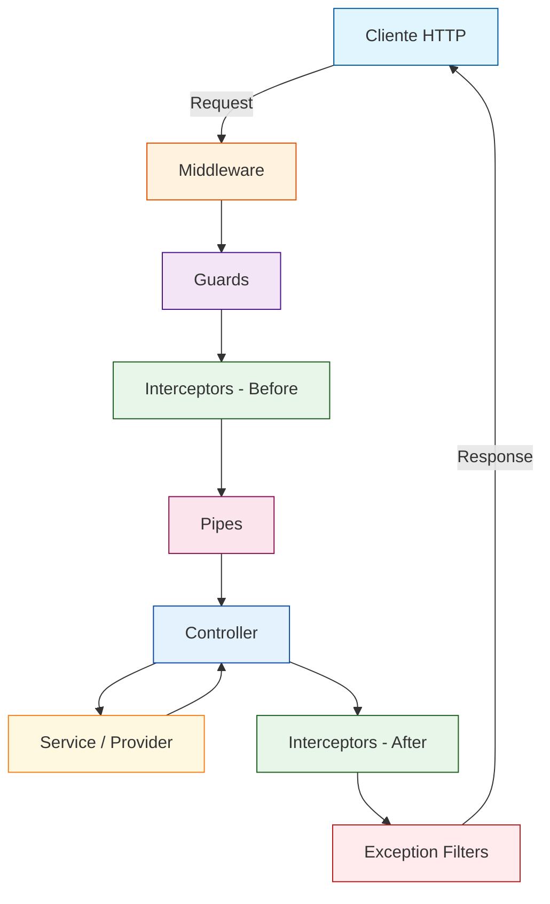

# Módulos y Controladores en NestJS

Los **módulos** organizan el código y los **controladores** manejan las solicitudes HTTP.

## Flujo de una Request HTTP

NestJS procesa cada request a través de una pipeline bien definida. Cada componente tiene una responsabilidad específica en el ciclo de vida de la solicitud.



### Descripción de cada Etapa

| Etapa | Componente | Responsabilidad |
|-------|-----------|-----------------|
| 1 | **Middleware** | Funciones ejecutadas antes del routing (logging, CORS, body parsing) |
| 2 | **Guards** | Determinan si la request puede proceder (autenticación, autorización) |
| 3 | **Interceptors (Before)** | Transforman la request antes de llegar al handler |
| 4 | **Pipes** | Validan y transforman los datos de entrada (DTOs) |
| 5 | **Controller** | Recibe la request y delega al servicio |
| 6 | **Service/Provider** | Ejecuta la lógica de negocio |
| 7 | **Interceptors (After)** | Transforman la response antes de enviarla |
| 8 | **Exception Filters** | Manejan errores y formatean respuestas de error |

### Ejemplo de Implementación

=== "Middleware"
    ```typescript
    import { Injectable, NestMiddleware } from '@nestjs/common';

    @Injectable()
    export class LoggerMiddleware implements NestMiddleware {
      use(req: Request, res: Response, next: Function) {
        console.log(`[${new Date().toISOString()}] ${req.method} ${req.url}`);
        next();
      }
    }
    ```

=== "Guard"
    ```typescript
    import { CanActivate, ExecutionContext, Injectable } from '@nestjs/common';
    import { JwtService } from '@nestjs/jwt';

    @Injectable()
    export class AuthGuard implements CanActivate {
      constructor(private jwtService: JwtService) {}

      canActivate(context: ExecutionContext): boolean {
        const request = context.switchToHttp().getRequest();
        const token = request.headers.authorization;
        return this.jwtService.verify(token);
      }
    }
    ```

=== "Pipe"
    ```typescript
    import { PipeTransform, Injectable, ArgumentMetadata } from '@nestjs/common';

    @Injectable()
    export class ValidationPipe implements PipeTransform {
      transform(value: any, metadata: ArgumentMetadata) {
        if (!value) {
          throw new BadRequestException('Value is required');
        }
        return value;
      }
    }
    ```

> **Tip**: El orden de ejecución es estricto: si un Guard falla, los Interceptors y Pipes downstream nunca se ejecutan. Esto permite un control granular sobre el flujo.

## Módulos

Un módulo es una clase anotada con `@Module()` que proporciona metadatos.

### Crear un Módulo

```typescript
import { Module } from '@nestjs/common';
import { UsersController } from './users.controller';
import { UsersService } from './users.service';

@Module({
  controllers: [UsersController],
  providers: [UsersService],
  exports: [UsersService],
})
export class UsersModule {}
```

### Módulo Raíz

Todo proyecto NestJS tiene un `AppModule` como punto de partida:

```typescript
// src/app.module.ts
import { Module } from '@nestjs/common';
import { UsersModule } from './users/users.module';

@Module({
  imports: [UsersModule],
})
export class AppModule {}
```

## Controladores

Los controladoreshandle incoming requests and return responses.

### Definir un Controlador

```typescript
import { Controller, Get, Post, Body } from '@nestjs/common';

@Controller('users')
export class UsersController {
  @Get()
  findAll(): string {
    return 'Lista de usuarios';
  }

  @Get(':id')
  findOne(@Param('id') id: string): string {
    return `Usuario #${id}`;
  }

  @Post()
  create(@Body() createUserDto: any): string {
    return 'Usuario creado';
  }
}
```

### Decoradores de Métodos HTTP

| Decorador | Método HTTP | Uso |
|-----------|-------------|-----|
| `@Get()` | GET | Obtener recursos |
| `@Post()` | POST | Crear recursos |
| `@Put()` | PUT | Actualizar completamente |
| `@Patch()` | PATCH | Actualizar parcialmente |
| `@Delete()` | DELETE | Eliminar recursos |

## Endpoints Comunes en REST

=== "GET /users"
    ```typescript
    @Get()
    findAll(): User[] {
      return this.usersService.findAll();
    }
    ```

=== "GET /users/:id"
    ```typescript
    @Get(':id')
    findOne(@Param('id') id: string): User {
      return this.usersService.findOne(id);
    }
    ```

=== "POST /users"
    ```typescript
    @Post()
    create(@Body() createUserDto: CreateUserDto): User {
      return this.usersService.create(createUserDto);
    }
    ```

=== "PUT /users/:id"
    ```typescript
    @Put(':id')
    update(
      @Param('id') id: string,
      @Body() updateUserDto: UpdateUserDto,
    ): User {
      return this.usersService.update(id, updateUserDto);
    }
    ```

## Gestión de Errores

> **Note**: NestJS lanza excepciones HTTP automáticamente para errores comunes (404, 500, etc.).

Para errores personalizados, usa `NotFoundException`:

```typescript
import { NotFoundException } from '@nestjs/common';

@Get(':id')
findOne(@Param('id') id: string) {
  const user = this.usersService.findOne(id);
  if (!user) {
    throw new NotFoundException(`Usuario con ID ${id} no encontrado`);
  }
  return user;
}
```

## Próximo Paso

Aprende sobre [Servicios y Providers](servicios-providers.md) para entender la lógica de negocio.
